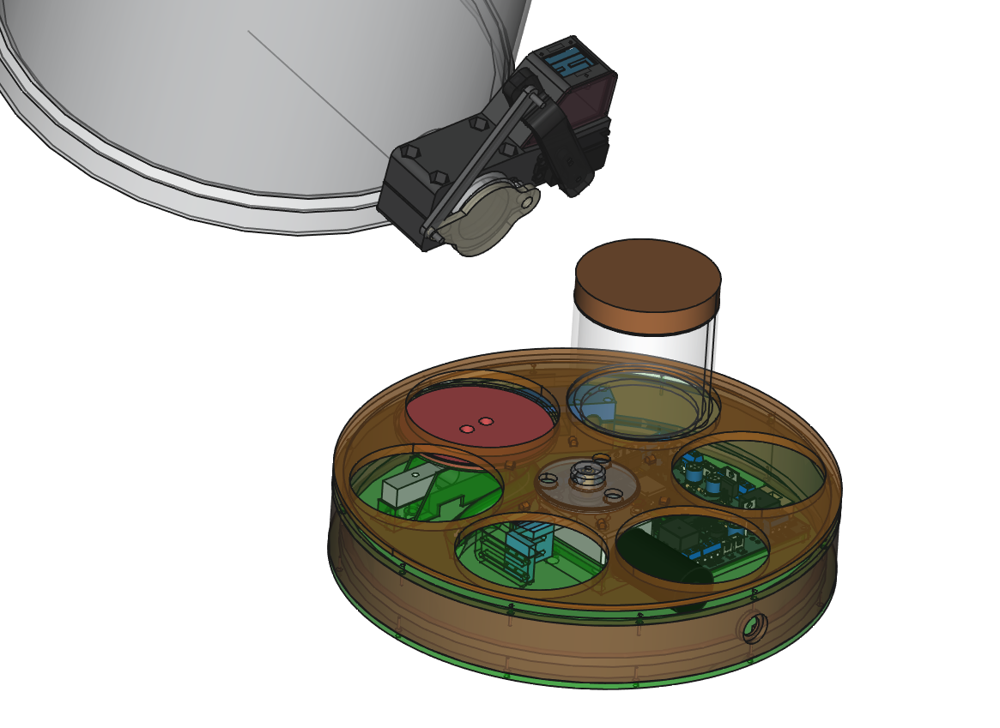
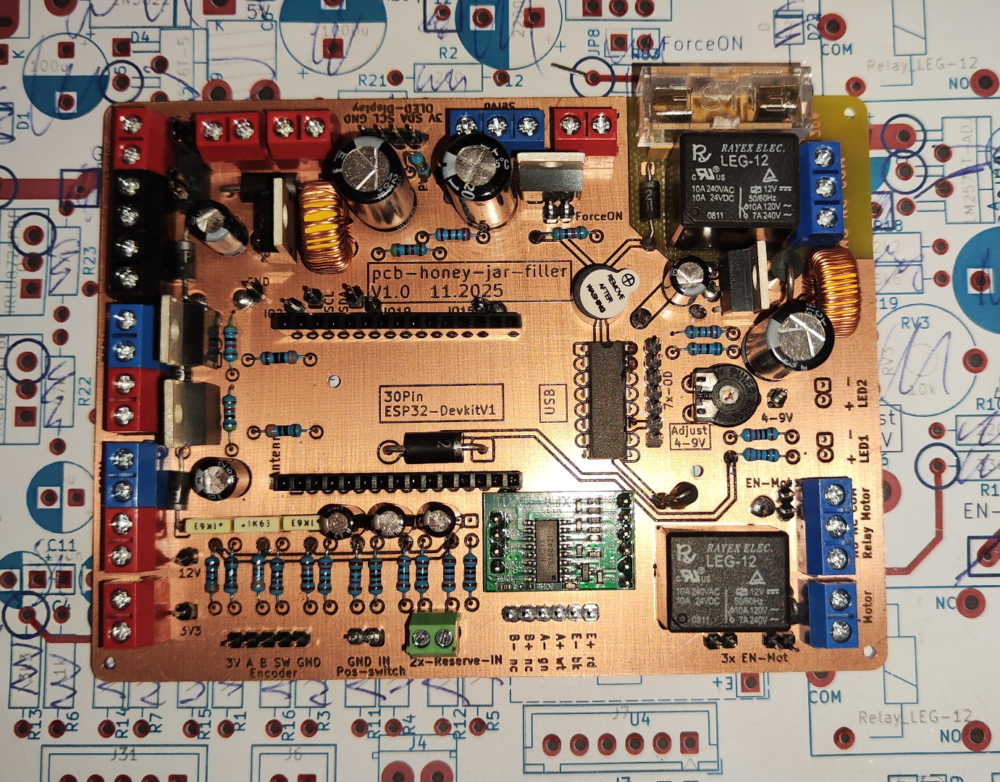
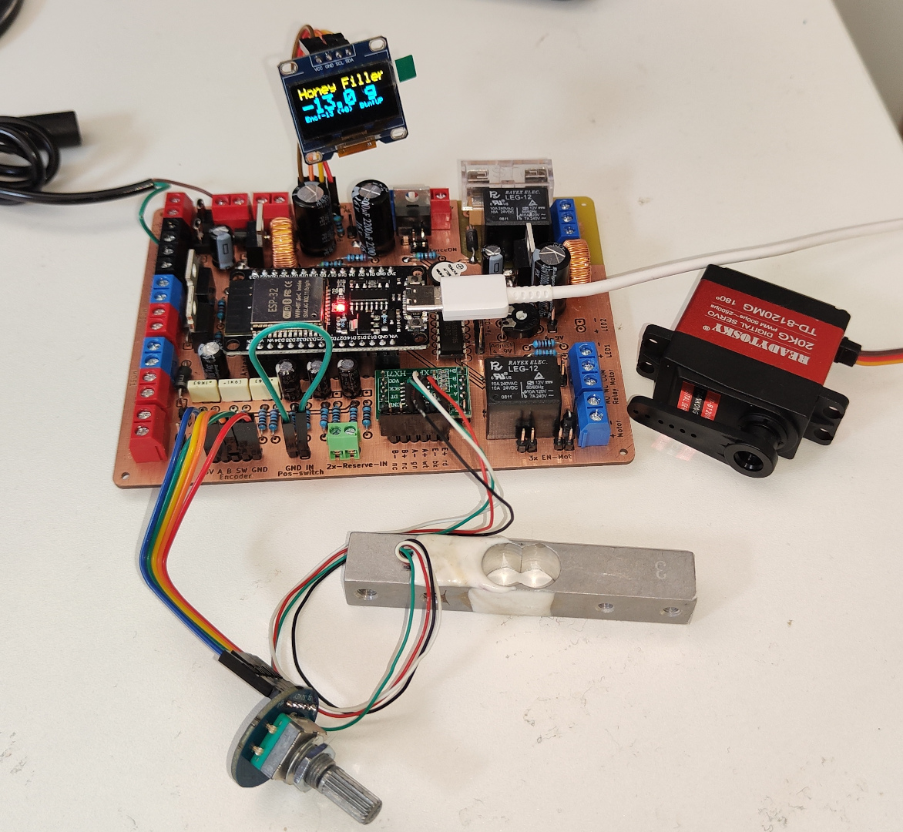

# honey-jar-filler

Semi-automatic **weight-based honey jar filler** with a **jar carousel/magazine** and a **servo-actuated honey gate**.  
This repo currently contains the **KiCad PCB-Project** and **FreeCAD** models and firmware (ESP-IDF).

  

*3d model of the planned system*

<p align="center">
  
  
</p>

*Left: board fully populated. Right: I/O test with all peripherals connected.*

## Repo contents
- `pcb_honey-jar-filler/` - KiCad project (schematic & PCB, exports)
- `cad/` - FreeCAD parts, 3D models, full assembly
- `firmware_honey-jar-filler/` - firmware for esp32 (ESP-IDF)

## Features (PCB / system)
- Load cell input (HX711) for weight-based dosing
- UI: rotary encoder, 2× buttons, LEDs, OLED display (I²C)
- Actuation: servo interface for honey gate; motor output for carousel
- Optional outputs: heater control, tank pressurization valve
- Power: 12–40 V input, 5 V buck (logic), adjustable 4–9 V rail (servo)

## Ideas
- Rotary carousel automation (indexing, run/stop with braking)
- Outlet warming (silicone band / water jacket)
- Jar presence detection
- Web UI / profiles / batch counter (ESP-IDF)

## Schematic + layout preview
<p align="center">
  <a href="pcb_honey-jar-filler/export/pcb_honey-jar-filler.pdf">
    
  </a>
  
</p>

## Firmware build (ESP-IDF)
- Install ESP-IDF (v5.x recommended) and export its environment (`. ./export.sh`).
- Enter the firmware project:
```bash
cd firmware_honey-jar-filler
```
- Set the target and build:
```bash
idf.py set-target esp32
idf.py build
```
- Flash and monitor (adjust serial port as needed):
```bash
idf.py -p /dev/ttyUSB0 flash monitor
```
