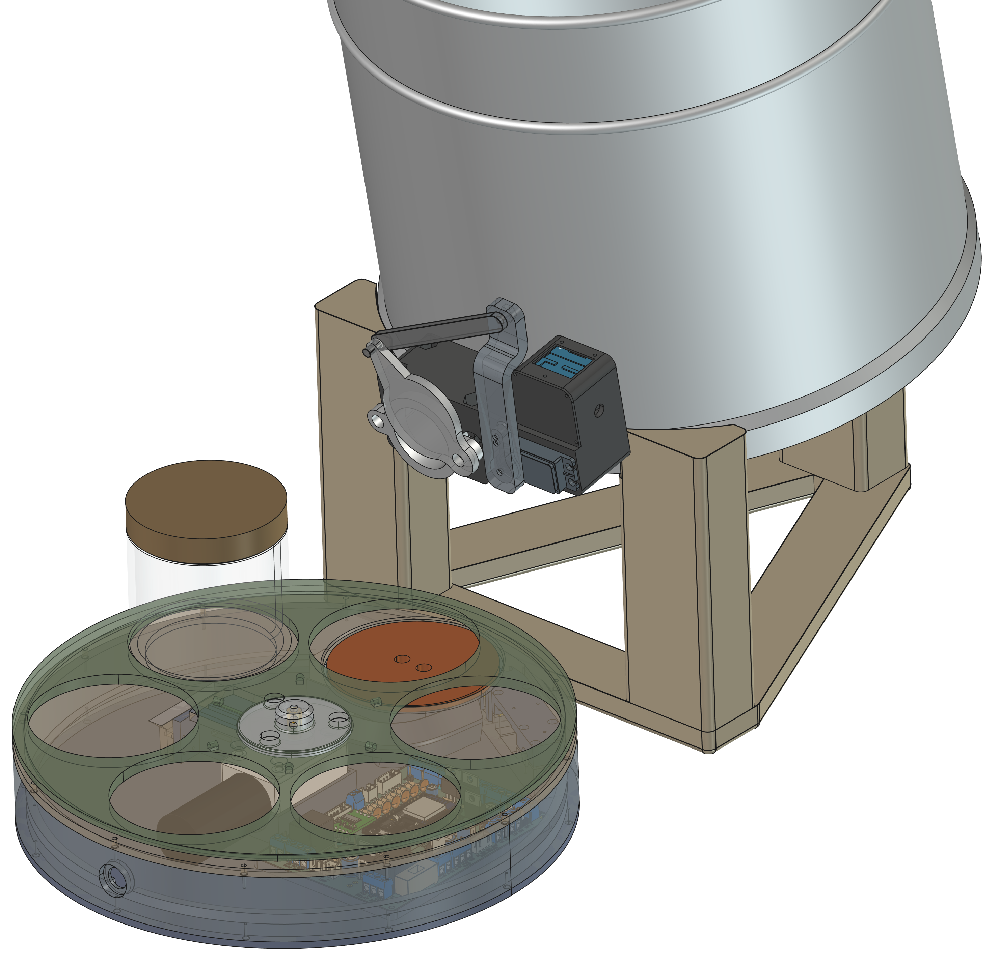

# honey-jar-filler

Semi-automatic **weight-based honey jar filler** with a **jar carousel/magazine** and a
**servo-actuated honey gate**. A load cell weighs each jar in real time while the
firmware modulates the gate to hit a target fill mass.

This repository holds the complete build — **KiCad PCB**, **FreeCAD** mechanics, and
**ESP-IDF firmware** — plus the telemetry tooling used to capture and analyse fills.
The machine is also the subject of a **bachelor thesis** that evaluates several
**dosing strategies** for accurately dispensing a viscous, drifting medium (honey);
see [Dosing strategies](#dosing-strategies).

<p align="center">
  
</p>

*System overview (CAD): pressurised bucket on the stand, the servo-actuated gate, and
the carousel base housing the control board and load cell, with a jar in position.*

<p align="center">
  
  
</p>

*Left: the custom control board, fully populated. Right: I/O bring-up with all
peripherals connected.*

## Repo contents
- `pcb_honey-jar-filler/` — KiCad project (schematic, PCB, exports)
- `cad/` — FreeCAD parts, 3D models, full assembly
- `firmware_honey-jar-filler/` — ESP32 firmware (ESP-IDF)
- `tools/telemetry/` — host-side capture, run-splitting, and plotting tools
- `doc/` — build photos and notes

## Features (PCB / system)
- Load cell input (HX711) for weight-based dosing
- UI: rotary encoder, 2× buttons, LEDs, OLED display (I²C)
- Actuation: servo interface for honey gate; motor output for carousel
- Optional outputs: heater control, tank pressurization valve
- Power: 12–40 V input, 5 V buck (logic), adjustable 4–9 V rail (servo)

## Dosing strategies
Dosing honey accurately is hard: there is a **dead time** of several seconds between
moving the gate and seeing the weight respond, the flow **keeps dripping after the
gate closes**, the gate→flow relationship is **nonlinear**, and disturbances
(viscosity, temperature, falling bucket level) **drift within and between fills**.
Fixed thresholds therefore cannot stay optimal, which is what motivates the strategy
comparison at the heart of the thesis.

The firmware implements the strategies as interchangeable modules
(`firmware_honey-jar-filler/components/filler/`), selectable from the OLED menu:

- **heuristic** — fixed two-stage thresholds; the simple baseline.
- **adaptive-heuristic** — the same fill sequence, but dead time, post-close drip and
  fill rates are learned between fills, so it converges after a jar or two.
- **flow-cascade** — a control-based approach: an outer deceleration rate profile
  (feed-forward trajectory) feeding an inner PI rate loop with an online-identified
  affine plant model and Smith-predictor dead-time compensation.
- **manual** / **sequence** — encoder-driven and scripted modes, used for bring-up and
  for capturing clean reference runs.

## Roadmap / ideas
- Rotary carousel automation (indexing, run/stop with braking)
- Outlet warming (silicone band / water jacket)
- Jar presence detection
- Web UI / profiles / batch counter

## Schematic + layout preview
<p align="center">
  <a href="pcb_honey-jar-filler/export/pcb_honey-jar-filler.pdf">
    
  </a>
  
</p>

## Firmware build (ESP-IDF)
- Install ESP-IDF **v5.5.1** and export its environment (`. ./export.sh`).
- Enter the firmware project:
```bash
cd firmware_honey-jar-filler
```
- Set the target and build:
```bash
idf.py set-target esp32
idf.py build
```
- No separate "install components" step is needed — `idf.py build` auto-fetches
  the managed components listed in `main/idf_component.yml` (esp-idf-lib hx711/
  encoder, ssd1306, servo, led_strip) into `managed_components/` on first run.
  `managed_components/` and `build/` are gitignored and regenerated per machine.
- `dependencies.lock` **is** committed and pins exact component versions — do
  not delete it. Some `idf_component.yml` entries use unbounded ranges (e.g.
  `esp-idf-lib/hx711: '*'`), and upstream has shipped breaking API changes
  under those ranges before (`esp-idf-lib/encoder` v2.0.0 rewrote the whole
  API); without the lock file, a fresh clone can silently resolve to an
  incompatible version and fail to compile.
- Flash and monitor (adjust serial port as needed):
```bash
idf.py -p /dev/ttyUSB0 flash monitor
```

## Firmware presets
- Runtime parameters are still defined centrally in `firmware_honey-jar-filler/components/app/app_params_def.h`.
- Each parameter there has one baseline default plus metadata such as min/max/step, UI text, and a scope:
  `APP_PARAM_SCOPE_PRESET` for recipe-specific values and `APP_PARAM_SCOPE_MACHINE` for shared machine settings.
- Built-in preset names and their default overrides live in `firmware_honey-jar-filler/components/app/app.c`.
  These preset defaults only override recipe-scoped fields; they do not duplicate the full parameter list.
- NVS stores shared machine settings separately from editable preset values:
  `machine_v1` for shared settings and `presets_v1` for preset-specific values.
- At boot, the active runtime config is rebuilt from baseline defaults + selected preset defaults + persisted machine settings + persisted preset values.

## Telemetry tools
- Structured telemetry is emitted on the normal UART console with a `TEL ` prefix and JSON payload.
- Normal ESP logs and machine telemetry therefore share one serial stream, but the telemetry lines can be split cleanly on the host.
- The intended workflow is:
  1. capture a session from UART
  2. keep the full console log for debugging
  3. store telemetry separately as NDJSON
  4. split runs and generate thesis figures from those files

Current script layout:
- `tools/telemetry/telemetry_tui.py`
  Recommended interactive wrapper / TUI entrypoint. Guides the user through
  capture, split, and plotting with session discovery, defaults, and command
  previews, while still calling the underlying scripts directly.
- `tools/telemetry/src/`
  Internal shared helpers for the telemetry scripts. Not intended to be run
  directly.
- `tools/telemetry/capture.py`
  Fully usable serial capture tool. Replaces the basic `idf.py monitor` workflow for experiment sessions and shows a live status line with telemetry counters.
- `tools/telemetry/split_runs.py`
  Offline splitter that converts one captured session into per-fill NDJSON files.
  It detects jar filling windows from `state=FILL`, adds configurable pre/post context,
  and writes `fills/index.json` plus `fill_0001.ndjson`, `fill_0002.ndjson`, ...
- `tools/telemetry/plot_runs.py`
  Offline chart exporter for thesis figures. It writes both a plain LaTeX-ready
  chart and a debug variant with metadata, based on fill mass, gate percentage,
  and FSM state overlays.
- `tools/telemetry/strategy_compare.py`
  Cross-strategy comparison charts (accuracy point clouds, speed–accuracy
  trade-off, throughput) for the thesis' strategy-comparison chapter. Reads each
  session's per-fill summaries and is explicit about which runs are a controlled
  comparison and which are only indicative.
- `tools/telemetry/cascade_analyze.py`
  Diagnostics for the flow-cascade strategy: per-fill plant-model estimate
  (gain/onset/lag) beside an offline ground-truth fit, to spot a diverging
  identifier at a glance.

Session capture output:
- `data/telemetry/<session>/session.log`
  Full serial console output, including normal ESP logs and raw `TEL` lines.
- `data/telemetry/<session>/telemetry.ndjson`
  Only telemetry payload lines, one JSON object per line.
- `data/telemetry/<session>/runs/run_0001.ndjson`
  Per-run telemetry files created live from `run_start` / `run_end` events, including configurable pre/post context.
- `data/telemetry/<session>/fills/index.json`
  Offline manifest of detected jar-fill windows with timing, preset, and parameter metadata.
- `data/telemetry/<session>/fills/fill_0001.ndjson`
  One offline per-fill telemetry slice intended for plotting and later comparison.
- `data/telemetry/<session>/session_meta.json`
  Port, baud rate, and capture timing settings.

Example capture usage:
```bash
python3 tools/telemetry/capture.py --port /dev/ttyUSB0 --baud 115200
```

Recommended interactive workflow:
```bash
python3 tools/telemetry/telemetry_tui.py
```

Example offline workflow:
```bash
python3 tools/telemetry/split_runs.py data/telemetry/2026.06.12_11:39-x-test --force
python3 tools/telemetry/plot_runs.py data/telemetry/2026.06.12_11:39-x-test/fills --list
python3 tools/telemetry/plot_runs.py data/telemetry/2026.06.12_11:39-x-test/fills --fills 1,3 --format pdf --format svg
```

Useful options:
- `--show-tel`
  Also print the `TEL` lines in the terminal instead of only saving them to files.
- `--pre-run-ms 2000 --post-run-ms 2000`
  Keep more telemetry context around each detected run.
- `--session-name my-test`
  Add a readable suffix after the timestamp, for example
  `2026.06.07_22:30-x-my-test`.

Goal of this tooling:
- keep experiment data self-describing and reproducible
- avoid manually filtering UART logs after each test
- support later batch plotting to vector PDF/SVG figures for the thesis
- preserve enough event context to compare different presets and control strategies cleanly
- make it obvious during capture that the custom telemetry tool is running, not plain `idf.py monitor`

## Wiring (servo mount DIN cable)
The cable with 15-pin DIN connector from the base assembly to the servo mount carries OLED, encoder, and servo signals + power.

OLED:
- green: GND
- red: 3V3
- orange: SDA
- yellow: SCL

Encoder:
- gray: SW
- blue: B
- light-green: A

Servo:
- brown, gray-brown, pink: 8V
- gray-black, black, white: GND
- purple: PWM
